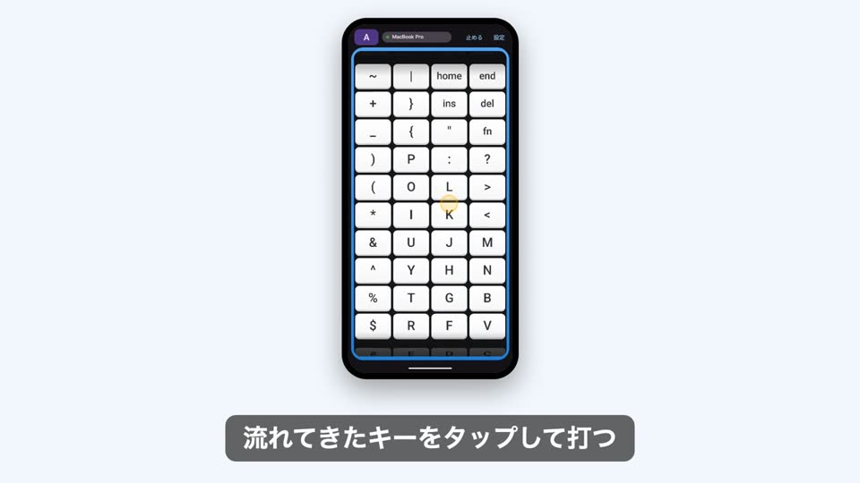

# Mozc Conveyorbelt for Android

Android スマートフォンを、Bluetooth 接続の外付け**ハードウェアキーボード**にするアプリです。
キーが 4 列のベルトコンベア上を流れてきて、それをタップして入力します。PC（Mac / Windows）からは普通の Bluetooth キーボードに見えるので、日本語入力は PC 側の IME（Mozc・Google 日本語入力・Microsoft IME など）がそのまま使えます。

## 元にしたキーボード

ハードウェア版の「Gboard くるくる（Mozc conveyor belt）」を、ソフトウェアで再現したものです。

- 元のキーボード: <https://github.com/google/mozc-devices/tree/main/mozc-conveyorbelt>

キー配列（JIS 配列・120 キー分）は、元のファームウェアの `keymap.h` から `tools/gen_keymap.py` で機械生成しています。Shift の自動付与、Fn での F1〜F10、6 キーロールオーバーといった入力処理も、元のファームウェア（`switches.c`）の動作に合わせています。

## 紹介動画

画像をクリックすると [Releases](https://github.com/poropi/mozc-conveyorbelt-android/releases/tag/v1.0) のページが開きます。そこから動画（`promo.mp4`、62 秒、BGM あり）をダウンロードして再生できます。

[](https://github.com/poropi/mozc-conveyorbelt-android/releases/tag/v1.0)

PC 側の画面は、実機の入力ログから再現した「イメージ」です。

## 特徴

- **Bluetooth HID キーボード**: Android の `BluetoothHidDevice`（Android 9 / API 28 以上）で登録します。IME（ソフトキーボード）ではありません。
- **流れるベルト**: モーターが回っている間、ベルトは一定速度で流れ続けます。キーをタップしても、なぞっても止まりません（実機のベルトの速さは不明のため、速さと向きは設定で変えられます）。
- **押しっぱなし**: キーを押さえている間は押された状態が続きます。Ctrl や Shift を押したまま別のキーを押せます。
- **ひらがな／英字ボタン**: ヘッダーの「あ／A」で PC の IME を切り替えます（Mac は英数／かなキー、Windows は半角/全角キー）。
- **自動接続**: 起動すると、前回つないだ PC へ自動で接続します。

## インストール

[Releases](https://github.com/poropi/mozc-conveyorbelt-android/releases/tag/v1.0) から `mozc-conveyorbelt-1.0.apk` をダウンロードして、Android 端末にインストールしてください（Android 9 以上）。
Play ストア外のアプリなので、端末側で「提供元不明のアプリ」のインストールを許可する必要があります。APK は自己署名です。

## 使い方

### 初めての PC（ペアリング）

1. アプリの「設定」（上部の状態表示をタップしても開きます）で「検出可能にする」を押し、「許可」を選びます。
2. PC の Bluetooth 設定で、この端末を探して接続します。
   - Mac: システム設定 → Bluetooth → 「近くのデバイス」
   - Windows: 設定 → Bluetooth とデバイス → デバイスを追加 → Bluetooth
3. 両方に同じ数字が出たら、端末で「ペア設定する」、PC で「接続」を押します。

### 2 回目以降

アプリを開くだけで接続します。つながらないときは、設定の「接続: （PC の名前）」ボタンを押してください。設定の「Mac／Windows」では、「あ／A」ボタンが送るキーの種類を選びます。

## ビルド

署名鍵がなくても debug ビルドはできます。release 署名をするときは、`keystore.properties`（`storeFile`・`storePassword`・`keyAlias`・`keyPassword`）をプロジェクト直下に置いてください。このファイルと keystore は git に入れません。

Android Studio、またはコマンドラインでビルドできます（JDK 17 と Android SDK が必要です）。

```sh
./gradlew :app:assembleDebug     # debug APK を作る
./gradlew :app:assembleRelease   # release APK を作る（署名は keystore.properties）
./gradlew :app:testDebugUnitTest # ユニットテスト
```

- minSdk 28 / targetSdk 36
- Jetpack Compose（Material 3）で作っています。ライブラリは AndroidX のみです。
- Android 12 以降は、実行時に `BLUETOOTH_CONNECT` などの権限が必要です。

## 構成

| パス | 内容 |
|---|---|
| `app/src/main/.../belt/` | ベルトの描画・流れる動き・ドラッグ判定 |
| `app/src/main/.../keyboard/` | キーマップ、HID レポート生成（Shift 自動付与・ロールオーバー）、IME 切り替えキー |
| `app/src/main/.../hid/` | `BluetoothHidDevice` の登録・接続・レポート送信、HID レポート記述子 |
| `tools/gen_keymap.py` | 元の `keymap.h` から `Keymap.kt` を生成 |

## 動作確認の状況

- 確認済み: Pixel 9a から Mac への入力（HID レベル）、ひらがな／英字の切り替え、起動時の自動接続、ユニットテスト。
- 未確認: Windows でのペアリングと入力、押しっぱなしでの同時押しの実機確認。

## 注意

- 配列は JIS 配列です。PC 側が US 配列として認識していると、記号キーが食い違います。
- 同時に HID デバイスとして登録できるアプリは 1 つだけです。

## ライセンス

[Apache License 2.0](LICENSE)。元のキーボード（google/mozc-devices）も Apache License 2.0 です。
